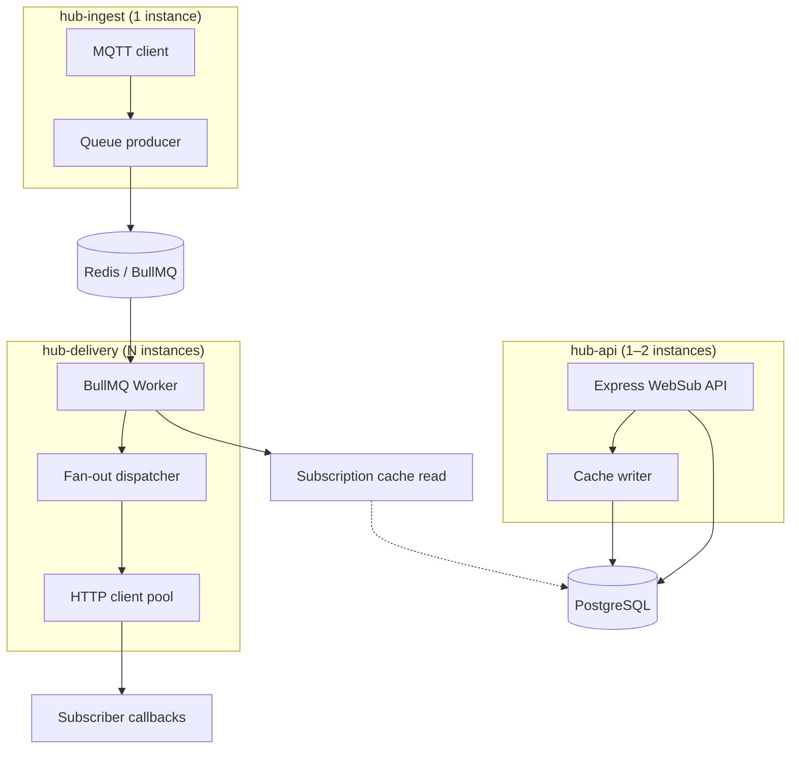
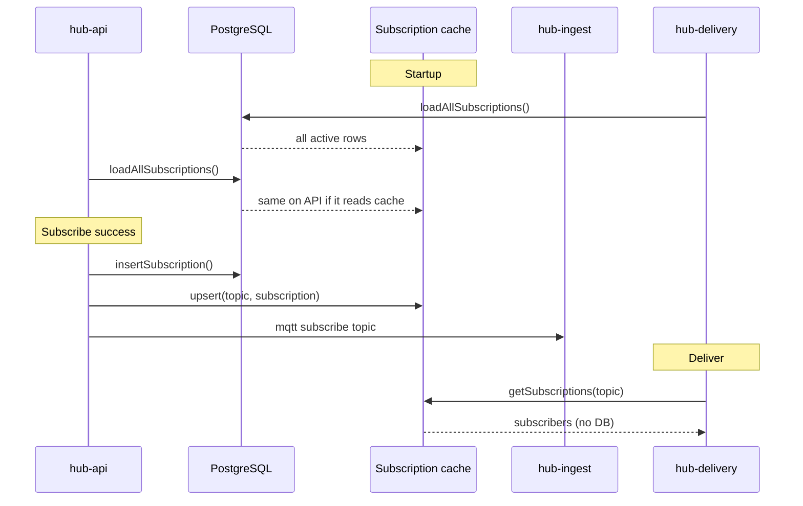
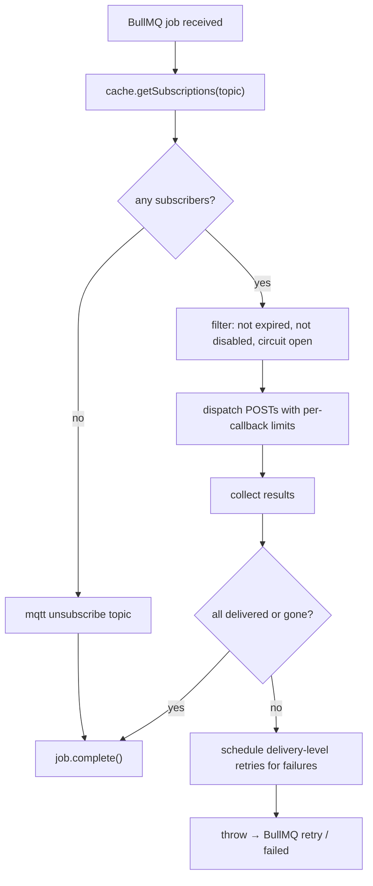
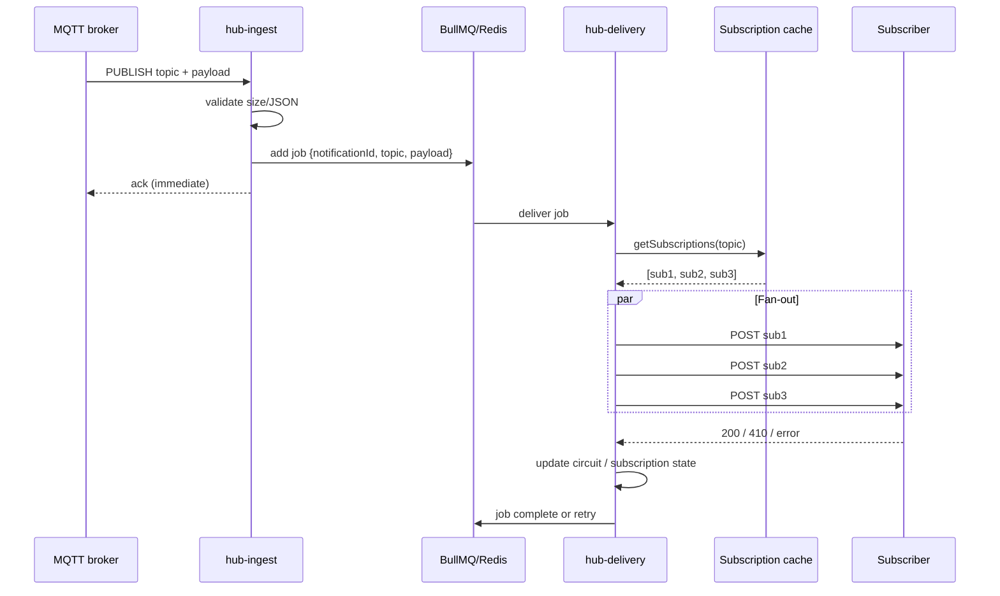

# STA-WebSub-Hub: Scalable Delivery Design

This document describes the target architecture for scaling the SensorThings API WebSub Hub to ~1,000 MQTT notifications per second while ensuring reliable HTTP(S) delivery to subscribers. It introduces **BullMQ on Redis** with a **worker fan-out** pattern.

## 1. Design goals

| Goal | How |
|------|-----|
| Sustain **~1,000 MQTT notifications/s** | MQTT handler only enqueues; no DB/HTTP on hot path |
| **Deliver every notification** via HTTP(S) | Durable BullMQ queue + retries + DLQ |
| **One job per MQTT message** | Fan-out to N subscribers inside the worker |
| Keep WebSub compliance | Intent validation, `Link` headers, `X-Hub-Signature`, 410 handling |
| Scale horizontally | Multiple delivery workers; single MQTT ingest |
| Minimal rewrite of subscription API | Keep `routes/*`, change delivery path only |

## 2. Problem statement

The current hot path is **MQTT `message` → `http_publish()` → DB lookup → N HTTP POSTs**. Under burst load this path does too much work synchronously and has no backpressure.

```javascript
// server.js — MQTT handler
http_publish(topic, message.toString());

// helpers/http_publish.js
let subscriptions = await db.getSubscriptions(topic);  // DB query per MQTT message
subscriptions.forEach(async (subscription) => {       // unbounded fire-and-forget
    request(subscription.callback, { ... });            // new HTTP connection each time
});
```

At **1,000 MQTT messages/s** with e.g. **3 subscribers per topic**, the system must sustain roughly **3,000 HTTP deliveries/s** plus **1,000 DB reads/s**. The current design cannot do that because:

| Issue | Effect under burst |
|--------|-------------------|
| **DB lookup on every message** | Postgres becomes the first choke point |
| **No queue / no backpressure** | Thousands of in-flight promises; memory and socket exhaustion |
| **Unbounded `forEach(async …)`** | No concurrency cap; slow subscribers block the system |
| **No HTTP connection reuse** | New TCP/TLS handshake per POST |
| **DB writes on delivery path** | Status updates amplify load on every success/failure |
| **Single Node process** | MQTT ingest, WebSub API, and delivery share one event loop |
| **No durable delivery log** | Crash or subscriber outage = lost notifications |
| **Disable after 2 failures** | Transient errors under load look like permanent failure |

## 3. Process topology

Three runnable roles (separate `node` entry points, later separate containers):



| Process | Entry file (proposed) | Responsibility |
|---------|----------------------|----------------|
| **hub-api** | `server-api.js` | Express, subscribe/unsubscribe, static files |
| **hub-ingest** | `server-ingest.js` | MQTT connect, validate, enqueue |
| **hub-delivery** | `server-delivery.js` | BullMQ worker, fan-out, HTTP POST |

For local dev / simple deploy, a `server-all.js` can run all three in one process. Production should split **ingest** and **delivery**.

**MQTT rule:** only **one** ingest instance subscribes to broker topics (or use broker shared-subscription if available). Multiple delivery workers are safe.

## 4. Proposed module layout

```
helpers/
  queue/
    connection.js      # shared Redis connection options
    producer.js        # enqueue notification jobs
    worker.js          # BullMQ Worker setup
  cache/
    subscriptions.js   # in-memory Map + warm-up + invalidation API
  delivery/
    fan_out.js         # fan-out orchestration for one job
    http_client.js     # undici Agent + POST helper
    circuit.js         # per-callback circuit breaker (in-memory)
    signature.js       # X-Hub-Signature helper
  db.js                # unchanged API; add loadAllSubscriptions()
  mqtt_client.js       # used only by ingest

server-api.js
server-ingest.js
server-delivery.js
```

`helpers/http_publish.js` is **retired**; its logic moves into `delivery/fan_out.js`.

## 5. BullMQ queue design

### 5.1 Single queue

```
Queue name:  notifications
Job name:    deliver
```

One queue, one job type. Fan-out happens **inside** the job processor.

### 5.2 Job payload

```json
{
  "notificationId": "uuid-v4",
  "topic": "/Things(1)/Datastreams(2)/Observations",
  "payload": "<raw JSON string>",
  "receivedAt": 1718534400123,
  "mqttMessageId": null
}
```

| Field | Purpose |
|-------|---------|
| `notificationId` | Idempotency / tracing; optional `X-Hub-Notification-Id` header |
| `topic` | MQTT topic path (same as today, without `STA_ROOT_URL` prefix) |
| `payload` | Full body to POST (≤ `max_content_size`) |
| `receivedAt` | Lag / SLA metrics |

**Do not** put the subscriber list in the job. Read from cache at processing time so new subscribers are not contacted for past messages and removed subscribers are not contacted for new ones.

### 5.3 Producer (ingest path)

```javascript
// Pseudocode — server-ingest.js message handler
async function onMqttMessage(topic, message) {
  if (message.length > config.max_content_size) { metrics.reject(); return; }
  if (config.hub.enforce_JSON) JSON.parse(message.toString());

  await notificationQueue.add(
    'deliver',
    {
      notificationId: crypto.randomUUID(),
      topic,
      payload: message.toString('utf8'),
      receivedAt: Date.now(),
    },
    jobOptions
  );
}
```

**Target latency:** enqueue only, return immediately.

### 5.4 Job options

```javascript
const jobOptions = {
  attempts: 1,           // see §5.6 — job-level vs delivery-level retries
  removeOnComplete: { count: 10_000 },
  removeOnFail: false,   // keep failed jobs for DLQ inspection
};
```

### 5.5 Queue retention / backpressure

```javascript
const MAX_WAITING = 120_000;  // ~2 min at 1k/s

if (await notificationQueue.getWaitingCount() > MAX_WAITING) {
  metrics.queue_full.inc();
  mqtt_client.pause();  // policy: pause MQTT or alert — configurable
}
```

Redis sizing: cap waiting jobs + `removeOnComplete` (~512 MB–1 GB Redis).

### 5.6 Two-level retry model

| Level | What retries | When |
|-------|--------------|------|
| **Delivery-level** (primary) | Individual POST to a callback | Transient HTTP errors, timeouts, 5xx |
| **Job-level** (safety net) | Whole notification | Worker crash mid-fan-out, partial fan-out failure |

**Delivery-level** (inside fan-out):

- Per `(notificationId, callback)` attempt tracking
- Exponential backoff: 1s, 2s, 4s, 8s, 16s (configurable)
- Max attempts per delivery: e.g. 8 over ~2 minutes

**Job-level:**

- `attempts: 3` on BullMQ only if fan-out reports **partial failure**
- Job completes only when **all non-disabled subscribers** received 2xx OR were removed (410)

## 6. Subscription cache

### 6.1 Structure

```javascript
// Map<topic, Subscription[]>
{
  "/Things(1)/Observations": [
    {
      id: 42,
      callback: "https://subscriber/app/callback",
      secret: "secret-or-null",
      duration: 1718538000,
      status: "active"
    }
  ]
}
```

Optional secondary index: `Map<callback, Set<topic>>` for fast invalidation on 410.

### 6.2 Lifecycle



| Event | Cache action |
|-------|--------------|
| Process startup | `loadAllSubscriptions()` from Postgres |
| Subscribe / update | `upsert(topic, sub)` |
| Unsubscribe / 410 / expiry | `remove(topic, callback)` |
| `deactivate` / `disable` | `updateStatus(callback, status)` |
| Periodic safety (60s) | Full reload or diff from DB |

### 6.3 Multi-instance consistency

- **hub-api** writes DB then updates cache locally
- Publish **cache invalidation** on Redis pub/sub channel `cache:invalidate`
- Delivery workers subscribe and update their local cache

For v1: single API instance or Redis pub/sub invalidation.

### 6.4 DB query for warm-up

```sql
SELECT t.topic, s.id, s.callback, s.secret, s.duration, s.status
FROM subscriptions s
JOIN topics t ON t.id = s.topic_id
WHERE s.status != 'disabled';
```

## 7. Worker fan-out (core delivery path)

### 7.1 Flow



### 7.2 Fan-out pseudocode

```javascript
async function processNotification(job) {
  const { notificationId, topic, payload } = job.data;
  const subs = subscriptionCache.getActive(topic);

  if (subs.length === 0) {
    await requestMqttUnsubscribe(topic);
    return;
  }

  const results = await Promise.allSettled(
    subs.map(sub => deliverToSubscriber({ notificationId, topic, payload, sub }))
  );

  const failed = results.filter(r => r.status === 'rejected' || r.value === 'retry');
  if (failed.length > 0) {
    throw new Error(`partial delivery: ${failed.length}/${subs.length}`);
  }
}
```

### 7.3 Per-subscriber delivery

```javascript
async function deliverToSubscriber({ notificationId, topic, payload, sub }) {
  if (isExpired(sub)) { await removeSubscription(topic, sub); return 'gone'; }
  if (sub.status === 'disabled') return 'skipped';
  if (circuit.isOpen(sub.callback)) return 'retry';

  const headers = buildWebSubHeaders(topic, payload, sub.secret);
  const response = await httpClient.post(sub.callback, payload, headers);

  if (response.status === 410) {
    await removeSubscription(topic, sub);
    return 'gone';
  }
  if (response.status >= 200 && response.status <= 299) {
    circuit.recordSuccess(sub.callback);
    if (sub.status === 'inactive') await activateSubscription(sub);
    return 'ok';
  }

  circuit.recordFailure(sub.callback);
  await handleDeliveryFailure(sub);
  throw new TransientDeliveryError(sub.callback, response.status);
}
```

### 7.4 Concurrency model

| Limiter | Default | Purpose |
|---------|---------|---------|
| **Worker concurrency** | 100 | Max jobs processed in parallel per delivery instance |
| **Global HTTP semaphore** | 500 per instance | Cap total in-flight POSTs |
| **Per-callback limiter** | 20 per callback URL | Protect slow subscribers |

```javascript
const limiters = new Map(); // callback → Bottleneck({ maxConcurrent: 20 })

function limiterFor(callback) {
  if (!limiters.has(callback)) {
    limiters.set(callback, new Bottleneck({ maxConcurrent: 20, minTime: 0 }));
  }
  return limiters.get(callback);
}
```

### 7.5 HTTP client

Replace `urllib` with **undici**:

```javascript
const agent = new Agent({
  connections: 100,
  pipelining: 1,
  keepAliveTimeout: 30_000,
  keepAliveMaxTimeout: 60_000,
});
```

Timeouts: connect 2s, body 30s (configurable).

## 8. WebSub semantics

### 8.1 Unchanged

- `POST /api/subscriptions` → 202, async subscribe/unsubscribe
- Publisher HEAD validation
- Subscriber challenge (GET + echo)
- `Content-Type: application/json`
- `Link: hub + self`
- `X-Hub-Signature` when `hub.secret` set
- 410 → delete subscription

### 8.2 Evolved for scale / reliability

| Current | Proposed |
|---------|----------|
| Disable after **2** failed deliveries | **Circuit breaker** per callback; retry with backoff; disable after sustained failure window |
| DB write on every success/failure | In-memory circuit state; flush status to DB on transition only |
| Synchronous delivery in MQTT handler | Queue + worker |

### 8.3 Optional header

```
X-Hub-Notification-Id: <notificationId>
```

Helps subscribers dedupe at-least-once deliveries. Document in OpenAPI.

## 9. Cross-process coordination

| Action | Mechanism |
|--------|-----------|
| MQTT subscribe on new topic | API publishes `mqtt:subscribe` → ingest handles |
| MQTT unsubscribe when empty | Worker publishes `mqtt:unsubscribe` → ingest handles |
| Cache update | API publishes `cache:invalidate` → all workers |

```javascript
// Redis channels
mqtt:commands     { action: 'subscribe'|'unsubscribe', topic }
cache:invalidate  { action: 'upsert'|'remove'|'reload', ... }
```

In **single-process dev mode**, call functions directly (no Redis pub/sub).

## 10. Configuration

Extend `settings.js` / `.env`:

```javascript
redis: {
  url: process.env.REDIS_URL || 'redis://localhost:6379',
  maxRetriesPerRequest: null,  // required for BullMQ
},
queue: {
  name: 'notifications',
  maxWaiting: 120_000,
  removeOnCompleteCount: 10_000,
},
delivery: {
  workerConcurrency: 100,
  maxInFlightHttp: 500,
  perCallbackConcurrency: 20,
  postTimeoutMs: 30_000,
  deliveryMaxAttempts: 8,
  deliveryBackoffMs: 1000,
  jobMaxAttempts: 3,
},
circuit: {
  failureThreshold: 10,
  windowMs: 60_000,
  openDurationMs: 30_000,
},
```

Environment variables:

| Variable | Default | Description |
|----------|---------|-------------|
| `REDIS_URL` | `redis://localhost:6379` | Redis connection for BullMQ |
| `HUB_MODE` | `all` | `all`, `api`, `ingest`, or `delivery` |
| `QUEUE_MAX_WAITING` | `120000` | Backpressure threshold |
| `DELIVERY_WORKER_CONCURRENCY` | `100` | Jobs per delivery worker |
| `DELIVERY_PER_CALLBACK_CONCURRENCY` | `20` | Max parallel POSTs per callback |

Docker Compose additions:

```yaml
redis:
  image: redis:7-alpine
  command: redis-server --maxmemory 1gb --maxmemory-policy noeviction
```

## 11. Memory sizing (Redis / BullMQ)

At **1,000 msg/s × ~1 KB**, **one job per MQTT message** (fan-out in worker):

| Scenario | Backlog | Estimated Redis memory |
|----------|---------|-------------------------|
| Steady state | ~0 s | ~0.5–2 MB |
| Minor lag | 1 s | ~3 MB |
| Moderate burst | 10 s | ~30 MB |
| Subscriber outage | 60 s | ~180 MB |
| Extended outage | 5 min | ~900 MB |

Plan **~3 KB per queued job** (1 KB payload + ~2 KB BullMQ/Redis overhead).

| Resource | Recommendation |
|----------|----------------|
| **Redis RAM** | 512 MB minimum; 1 GB for ~5+ min backlog headroom |
| **Queue cap** | `MAXLEN` / max waiting ~120,000 (~2 min at 1k/s) |
| **Delivery workers** | 2–4 × 256–512 MB each |
| **Total new infra RAM** | ~1.5–3 GB |

## 12. Database changes

**Minimal for v1** — existing schema is sufficient.

Optional additions (v2):

```sql
CREATE TABLE delivery_failures (
  id serial PRIMARY KEY,
  notification_id uuid NOT NULL,
  topic varchar NOT NULL,
  callback varchar NOT NULL,
  last_status int,
  attempts int,
  last_error text,
  created_at timestamptz DEFAULT now()
);
```

No per-message table needed if BullMQ holds pending work.

## 13. Deployment matrix

| Environment | Processes | Redis | Workers |
|-------------|-----------|-------|---------|
| **Dev** | `server-all.js` (monolith) | 1 local | concurrency 10 |
| **Test** | docker-compose + existing tests | 1 | 1 worker |
| **Prod** | api ×1, ingest ×1, delivery ×3 | 1 (or Sentinel later) | concurrency 100 each |

```yaml
services:
  redis: ...
  sta-websub-hub-api:
    command: node server-api.js
  sta-websub-hub-ingest:
    command: node server-ingest.js
  sta-websub-hub-delivery:
    command: node server-delivery.js
    deploy:
      replicas: 3
```

## 14. Observability

### Metrics

```
hub_mqtt_messages_received_total
hub_queue_enqueue_total
hub_queue_waiting_jobs
hub_queue_active_jobs
hub_queue_enqueue_errors_total
hub_delivery_job_duration_seconds
hub_delivery_post_total{status}
hub_delivery_post_duration_seconds
hub_subscriber_circuit_open{callback}
hub_cache_subscriptions{topic}
```

### Health checks

| Endpoint | Process |
|----------|---------|
| `GET /health` | api: DB ok |
| `GET /health` | ingest: MQTT connected, Redis ok |
| `GET /health` | delivery: Redis ok, worker running |

## 15. Failure scenarios

| Scenario | Behaviour |
|----------|-----------|
| Subscriber down 30s | Delivery retries with backoff; queue backs up; other subscribers unaffected |
| Worker crash mid-job | BullMQ reclaims stalled job; at-least-once → possible duplicate POST |
| Redis down | Ingest cannot enqueue → pause MQTT, alert |
| Postgres down | API cannot subscribe; delivery uses cache (stale until restored) |
| Duplicate MQTT message | Two jobs → two POSTs (optional dedupe via `jobId`) |
| 410 from subscriber | Remove sub; job succeeds if all others ok |

## 16. End-to-end delivery sequence



## 17. Changes to existing files

| File | Change |
|------|--------|
| `routes/subscriptions.js` | Minor — cache invalidation hook after 202 |
| `routes/subscribe.js` | After DB insert → `cache.upsert()` + `mqtt:subscribe` |
| `routes/unsubscribe.js` | After DB delete → `cache.remove()` + maybe `mqtt:unsubscribe` |
| `helpers/db.js` | Add `loadAllSubscriptions()`; keep status helpers |
| `helpers/http_publish.js` | **Remove** after migration |
| `server.js` | **Replace** by role-specific entry points |

## 18. Implementation phases

### Phase 1 — Foundation (no process split)

1. Add Redis + BullMQ dependencies
2. `helpers/cache/subscriptions.js` + `loadAllSubscriptions()`
3. `helpers/queue/producer.js` — enqueue from current `server.js`
4. `helpers/delivery/fan_out.js` + `http_client.js`
5. `server-delivery.js` worker; run alongside existing `server.js`
6. Remove DB call from hot path

### Phase 2 — Split ingest

7. `server-ingest.js` — MQTT only
8. `server-api.js` — Express only
9. Redis pub/sub for mqtt commands + cache invalidation

### Phase 3 — Hardening

10. Circuit breaker + revised disable policy
11. Metrics + queue backpressure (pause MQTT)
12. Load tests (1k/s, 1 KB)
13. Update README + docker-compose

## 19. Open decisions

1. **Monolith dev mode** — keep `npm start` running all roles via `HUB_MODE=all|api|ingest|delivery`? **Recommended: yes.**

2. **Partial fan-out failure** — fail whole job or use child jobs per callback? **Recommended:** delivery-level retry inside job first; escalate to job retry if inner retries exhausted.

3. **Disable policy** — keep "2 strikes" or switch to circuit breaker? **Recommended:** circuit breaker for production scale.

4. **`notificationId` header** — add optional `X-Hub-Notification-Id`? **Recommended:** yes, document in OpenAPI.

## 20. Why BullMQ over raw Redis Streams

BullMQ runs on Redis. At 1k/s the memory difference vs Redis Streams is small (~tens of MB). BullMQ is preferred because:

- Built-in retries, backoff, stalled-job recovery, and failed-job retention (DLQ)
- Worker concurrency and rate limiting fit per-subscriber throttling
- Less custom queue infrastructure to maintain in a Node.js codebase
- Fan-out stays in application code; queue holds one job per MQTT message

Redis Streams remains a valid alternative if the team prefers minimal dependencies and will own retry/DLQ logic.
