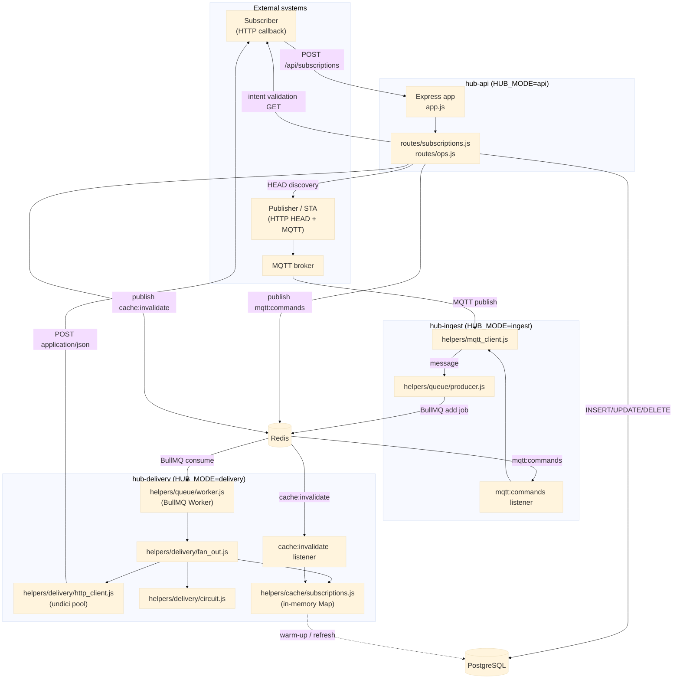

<link rel="stylesheet" href="../architecture-print.css">

# Diagram: Component / Services

```mermaid
%%{init: {
  'theme': 'base',
  'themeVariables': {
    'fontSize': '22px',
    'fontFamily': 'arial',
    'actorFontSize': '22px',
    'noteFontSize': '20px',
    'messageFontSize': '20px',
    'signalFontSize': '20px'
  }
}}%%
flowchart TB
    subgraph external ["External systems"]
        Sub["Subscriber<br/>(HTTP callback)"]
        Pub["Publisher / STA<br/>(HTTP HEAD + MQTT)"]
        Broker["MQTT broker"]
    end

    subgraph hub_api ["hub-api (HUB_MODE=api)"]
        Express["Express app<br/>app.js"]
        Routes["routes/subscriptions.js<br/>routes/ops.js"]
        Express --> Routes
    end

    subgraph hub_ingest ["hub-ingest (HUB_MODE=ingest)"]
        MqttClient["helpers/mqtt_client.js"]
        Producer["helpers/queue/producer.js"]
        MqttCmdListener["mqtt:commands listener"]
        MqttClient -->|"message"| Producer
        MqttCmdListener --> MqttClient
    end

    subgraph hub_delivery ["hub-delivery (HUB_MODE=delivery)"]
        Worker["helpers/queue/worker.js<br/>(BullMQ Worker)"]
        FanOut["helpers/delivery/fan_out.js"]
        HttpClient["helpers/delivery/http_client.js<br/>(undici pool)"]
        Circuit["helpers/delivery/circuit.js"]
        CacheListener["cache:invalidate listener"]
        SubCache["helpers/cache/subscriptions.js<br/>(in-memory Map)"]
        Worker --> FanOut
        FanOut --> Circuit
        FanOut --> HttpClient
        FanOut --> SubCache
        CacheListener --> SubCache
    end

    Redis[("Redis")]
    PG[("PostgreSQL")]

    Sub -->|"POST /api/subscriptions"| Express
    Routes -->|"HEAD discovery"| Pub
    Routes -->|"intent validation GET"| Sub
    Routes -->|"INSERT/UPDATE/DELETE"| PG
    Routes -->|"publish mqtt:commands"| Redis
    Routes -->|"publish cache:invalidate"| Redis

    Pub --> Broker
    Broker -->|"MQTT publish"| MqttClient
    Producer -->|"BullMQ add job"| Redis
    Redis -->|"mqtt:commands"| MqttCmdListener
    Redis -->|"cache:invalidate"| CacheListener
    Redis -->|"BullMQ consume"| Worker
    SubCache -.->|"warm-up / refresh"| PG
    HttpClient -->|"POST application/json"| Sub
```

[← Back to architecture.md](../architecture.md)
