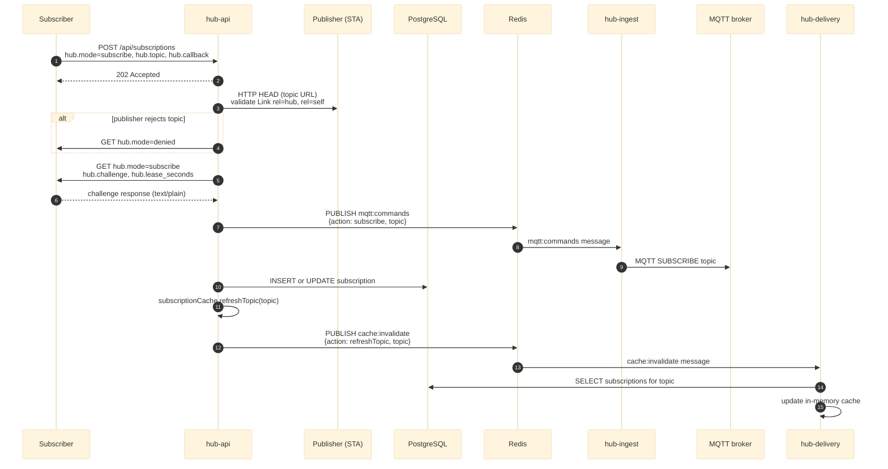

<link rel="stylesheet" href="../architecture-print.css">

# Diagram: Subscribe Flow

```mermaid
%%{init: {
  'theme': 'base',
  'themeVariables': {
    'fontSize': '22px',
    'fontFamily': 'arial',
    'actorFontSize': '22px',
    'noteFontSize': '20px',
    'messageFontSize': '20px',
    'signalFontSize': '20px'
  }
}}%%
sequenceDiagram
    autonumber
    participant Sub as Subscriber
    participant API as hub-api
    participant Pub as Publisher (STA)
    participant PG as PostgreSQL
    participant Redis as Redis
    participant Ingest as hub-ingest
    participant Broker as MQTT broker
    participant Delivery as hub-delivery

    Sub->>API: POST /api/subscriptions<br/>hub.mode=subscribe, hub.topic, hub.callback
    API-->>Sub: 202 Accepted

    API->>Pub: HTTP HEAD (topic URL)<br/>validate Link rel=hub, rel=self
    alt publisher rejects topic
        API->>Sub: GET hub.mode=denied
    end

    API->>Sub: GET hub.mode=subscribe<br/>hub.challenge, hub.lease_seconds
    Sub-->>API: challenge response (text/plain)

    API->>Redis: PUBLISH mqtt:commands<br/>{action: subscribe, topic}
    Redis->>Ingest: mqtt:commands message
    Ingest->>Broker: MQTT SUBSCRIBE topic

    API->>PG: INSERT or UPDATE subscription
    API->>API: subscriptionCache.refreshTopic(topic)
    API->>Redis: PUBLISH cache:invalidate<br/>{action: refreshTopic, topic}
    Redis->>Delivery: cache:invalidate message
    Delivery->>PG: SELECT subscriptions for topic
    Delivery->>Delivery: update in-memory cache
```

[← Back to architecture.md](../architecture.md)
