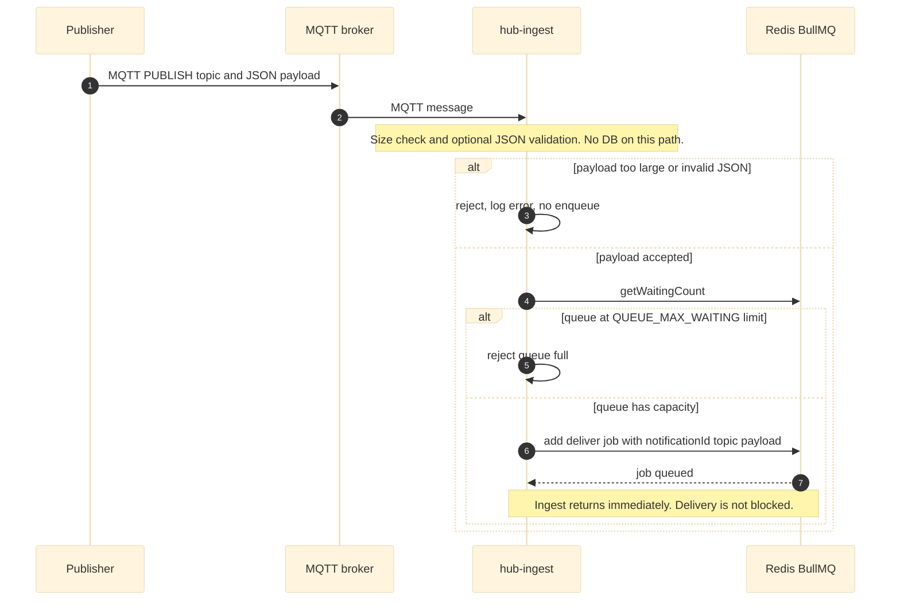

<link rel="stylesheet" href="../architecture-print.css">

# Diagram: Notification - Adding to Queue

[← Back to architecture.md](../architecture.md) · [Worker reads queue →](05-notification-delivery.md)
