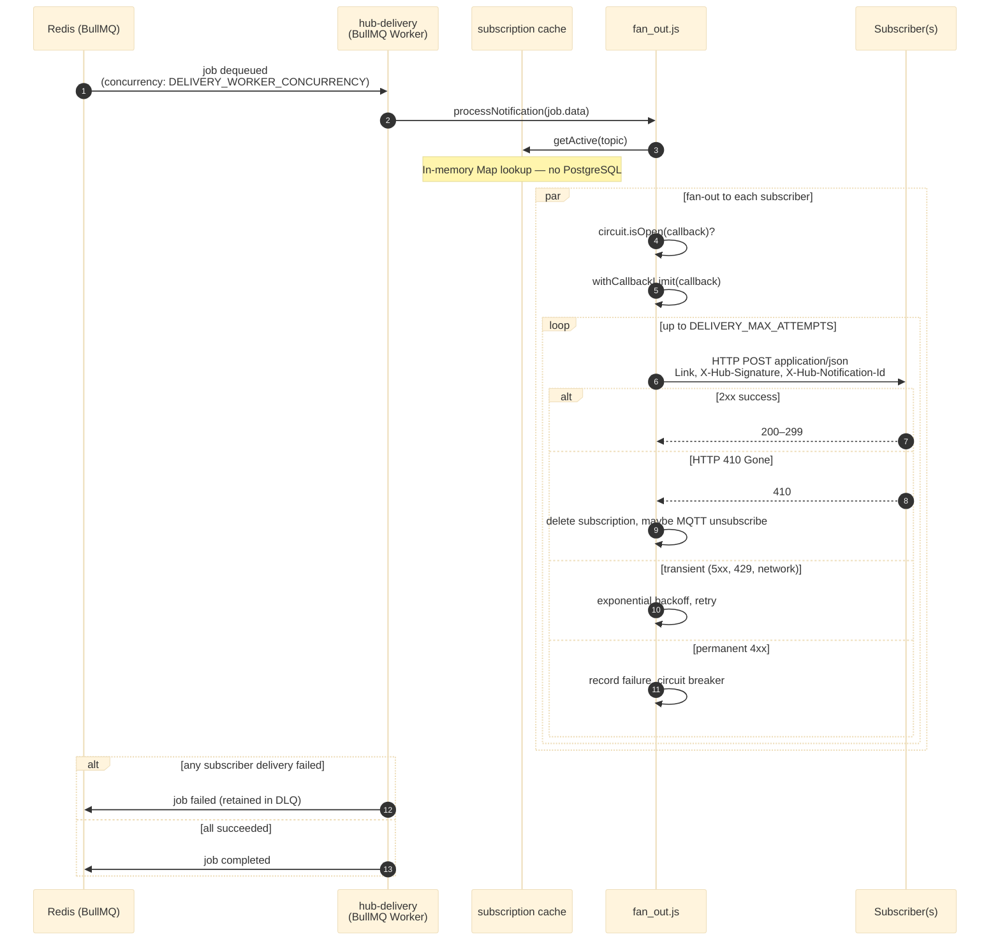

<link rel="stylesheet" href="../architecture-print.css">

# Diagram: Notification — Worker Reads Queue

[← Adding to queue](04-notification-enqueue.md) · [← Back to architecture.md](../architecture.md)
